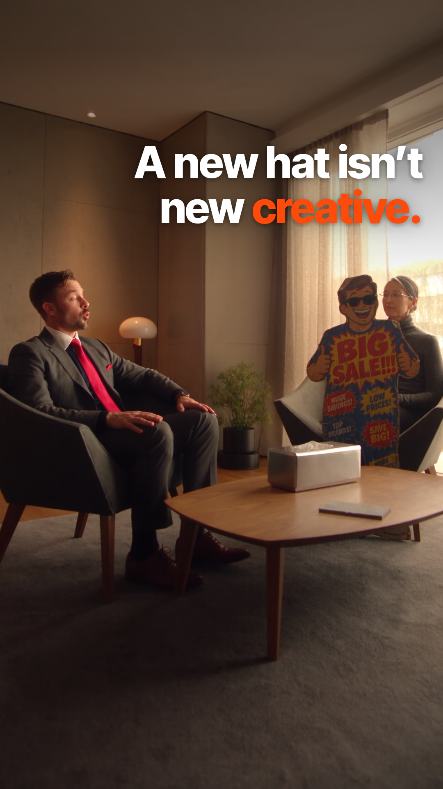
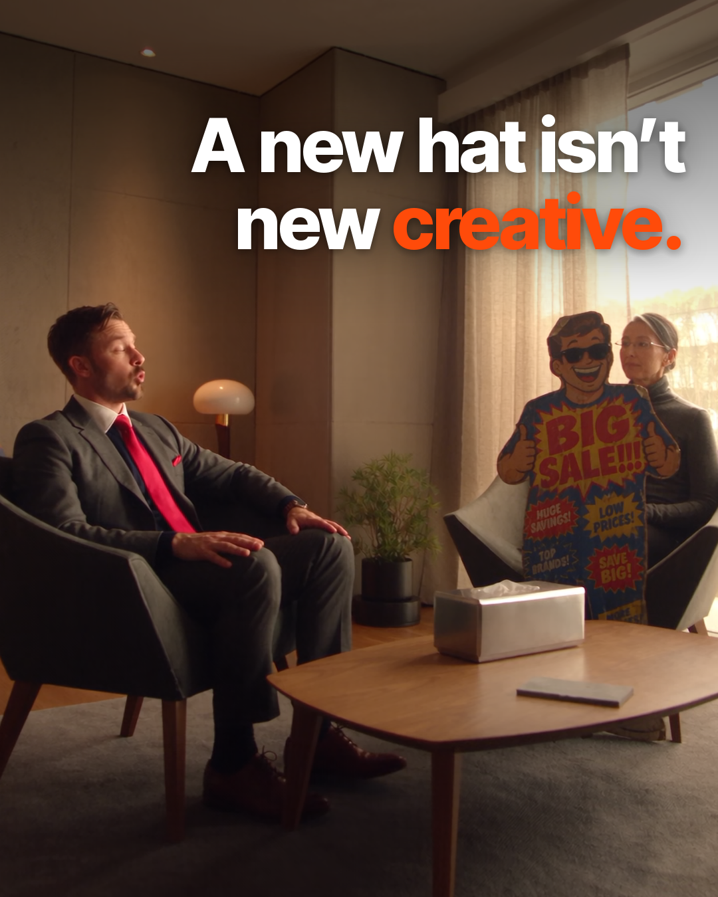
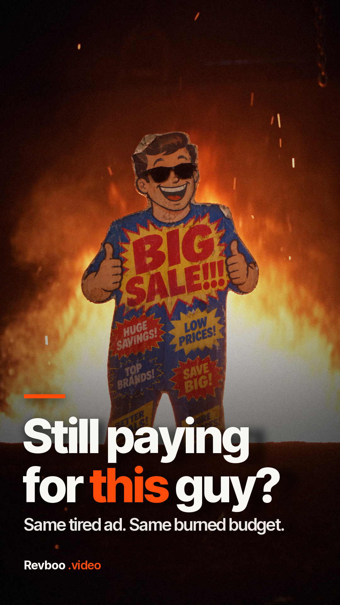
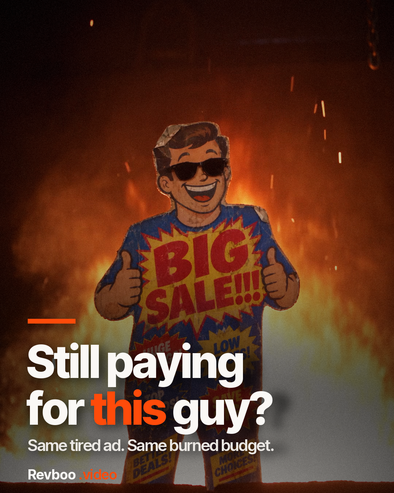
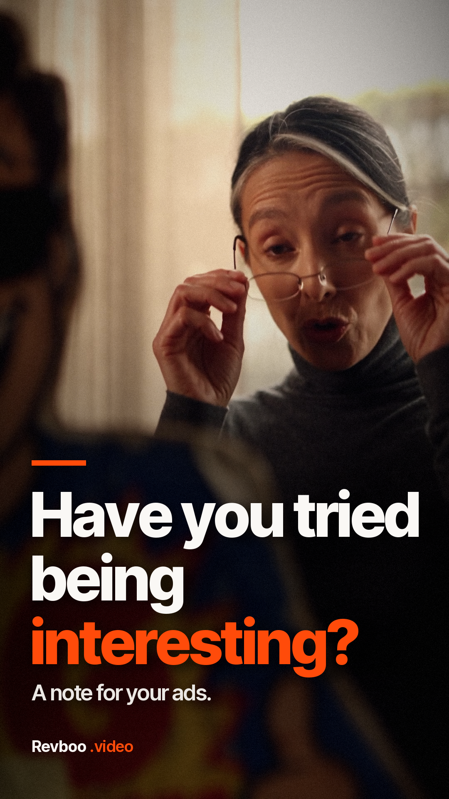
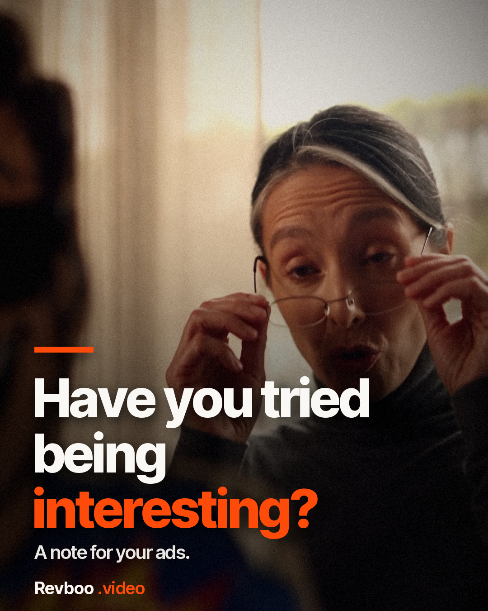
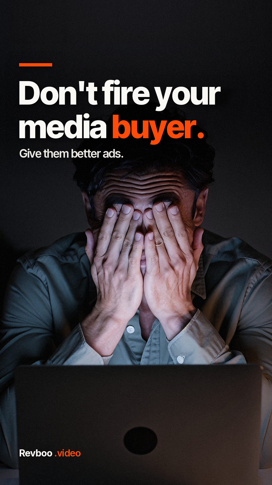
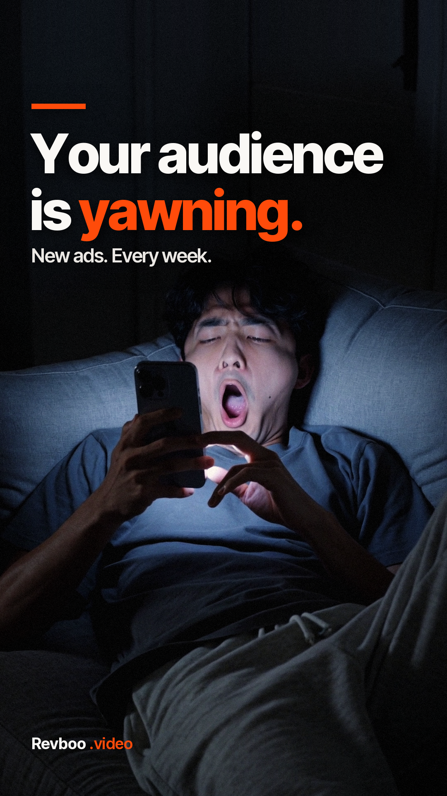
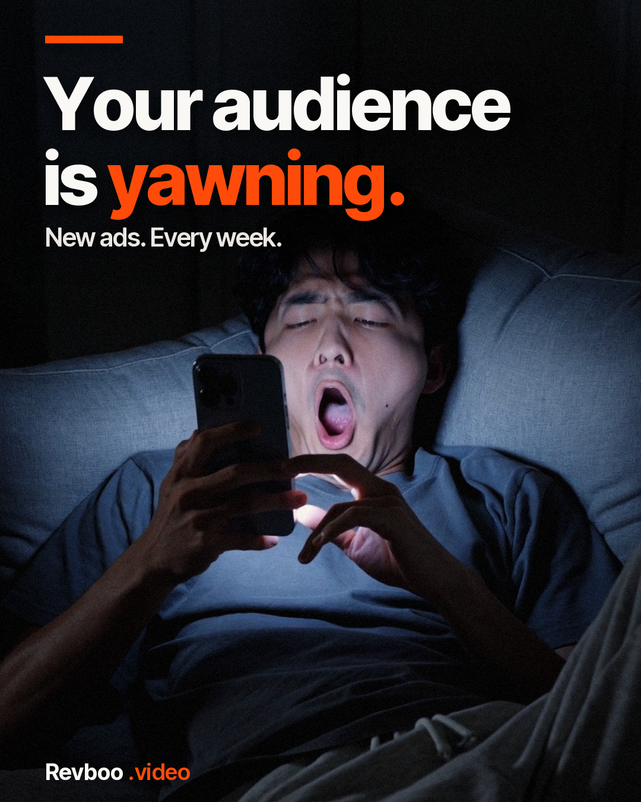

# FINALS: approved Revboo assets

> **Other AIs / editors: only use files listed under APPROVED below.** Everything else in the library is unreviewed (or rejected). Ask Chase before using it.
> **Other AIs: follow [BRAND.md](BRAND.md) for all Revboo ads** (house caption standard, colors, fonts, covers, end card, audio, banned styles).
> **★ The "Approved – Ready to Run" section below is the source of truth for what runs** (ranked 1-10; from `approved_ranking` in `catalog/registry.json`).
> Shared catalog: Furnace = concept **RB-005**, New Hat = **RB-004** in `catalog/registry.json` (see [AGENTS.md](AGENTS.md)). All 10 ranked concepts are **Approved** (Chase, Oct 4, 2026, 1:33 PM MT); each concept carries `approved_rank`, `approved_star` and `approved_asset_ids`.
> Generated by `make_finals.py` from `manifest.json` + `covers.json`. Machine-readable copy: [`finals.json`](finals.json). Library page: https://cryptouprise.github.io/revboo-library/

## ★ Approved – Ready to Run

> Chase approved all 10 on **Oct 4, 2026, 1:33 PM MT**. Run in rank order. Play them at the top of the [library page](https://cryptouprise.github.io/revboo-library/#approved). To swap in a fixed version: update that rank in `approved_ranking` (catalog/registry.json) and rerun `python3 make_finals.py`.

| ★ | Ad | Concept | Files (web copy · full-quality master) | Covers | Status |
|---|---|---|---|---|---|
| **★ 1** | Furnace – Captioned | RB-005 | 9:16 `furnace-captioned-9x16-v1` 17.5 s: [web](https://github.com/Cryptouprise/revboo-library/releases/download/media-v1/furnace-captioned-9x16-v1.mp4) · [master](https://github.com/Cryptouprise/revboo-library/releases/download/media-v1/furnace-captioned-9x16-v1-MASTER.mp4) 4:5 `furnace-captioned-4x5-v1` 17.5 s: [web](https://github.com/Cryptouprise/revboo-library/releases/download/media-v1/furnace-captioned-4x5-v1.mp4) · [master](https://github.com/Cryptouprise/revboo-library/releases/download/media-v1/furnace-captioned-4x5-v1-MASTER.mp4) 9:16 hook-cover test `furnace-captioned-9x16-hookcover-v1` 18.8 s: [web](https://github.com/Cryptouprise/revboo-library/releases/download/media-v1/furnace-captioned-9x16-hookcover-v1.mp4) · [master](https://github.com/Cryptouprise/revboo-library/releases/download/media-v1/furnace-captioned-9x16-hookcover-v1-MASTER.mp4) |   | ★ **Approved** |
| **★ 2** | A New Hat Isn't New Creative – Captioned | RB-004 | 9:16 `new-hat-captioned-9x16-v1` 22.0 s: [web](https://github.com/Cryptouprise/revboo-library/releases/download/media-v1/new-hat-captioned-9x16-v1.mp4) · [master](https://github.com/Cryptouprise/revboo-library/releases/download/media-v1/new-hat-captioned-9x16-v1-MASTER.mp4) 4:5 `new-hat-captioned-4x5-v1` 22.0 s: [web](https://github.com/Cryptouprise/revboo-library/releases/download/media-v1/new-hat-captioned-4x5-v1.mp4) · [master](https://github.com/Cryptouprise/revboo-library/releases/download/media-v1/new-hat-captioned-4x5-v1-MASTER.mp4) |   | ★ **Approved** |
| **★ 3** | Have You Tried Being Interesting? (Best-of) | RB-015 | 9:16 `revboo-bestof-9x16-v1` 29.9 s: [web](https://github.com/Cryptouprise/revboo-library/releases/download/media-v1/revboo-bestof-9x16-v1.mp4) · [master](https://github.com/Cryptouprise/revboo-library/releases/download/media-v1/revboo-bestof-9x16-v1-MASTER.mp4) 4:5 `revboo-bestof-4x5-v1` 29.9 s: [web](https://github.com/Cryptouprise/revboo-library/releases/download/media-v1/revboo-bestof-4x5-v1.mp4) · [master](https://github.com/Cryptouprise/revboo-library/releases/download/media-v1/revboo-bestof-4x5-v1-MASTER.mp4) |         | ★ **Approved** |
| **★ 4** | The Ad Doctor | RB-008 | 9:16 `rb-008-a-v02-9x16` 22.6 s: [web](https://github.com/Cryptouprise/revboo-library/releases/download/media-v1/rb-008-a-v02-9x16.mp4) · [master](https://github.com/Cryptouprise/revboo-library/releases/download/media-v1/rb-008-a-v02-9x16-MASTER.mp4) 4:5 `rb-008-a-v02-4x5` 22.6 s: [web](https://github.com/Cryptouprise/revboo-library/releases/download/media-v1/rb-008-a-v02-4x5.mp4) · [master](https://github.com/Cryptouprise/revboo-library/releases/download/media-v1/rb-008-a-v02-4x5-MASTER.mp4) | poster frame | ★ **Approved** |
| **★ 5** | Tube Man | RB-012 | 9:16 `rb-012-a-v02-9x16` 27.4 s: [web](https://github.com/Cryptouprise/revboo-library/releases/download/media-v1/rb-012-a-v02-9x16.mp4) · [master](https://github.com/Cryptouprise/revboo-library/releases/download/media-v1/rb-012-a-v02-9x16-MASTER.mp4) 4:5 `rb-012-a-v02-4x5` 27.4 s: [web](https://github.com/Cryptouprise/revboo-library/releases/download/media-v1/rb-012-a-v02-4x5.mp4) · [master](https://github.com/Cryptouprise/revboo-library/releases/download/media-v1/rb-012-a-v02-4x5-MASTER.mp4) | poster frame | ★ **Approved** |
| **★ 6** | PI Attorneys – Scroll Past | PI-008 | 9:16 `pi-008-a-v02-9x16` 26.4 s: [web](https://github.com/Cryptouprise/revboo-library/releases/download/media-v1/pi-008-a-v02-9x16.mp4) · [master](https://github.com/Cryptouprise/revboo-library/releases/download/media-v1/pi-008-a-v02-9x16-MASTER.mp4) 4:5 `pi-008-a-v02-4x5` 26.4 s: [web](https://github.com/Cryptouprise/revboo-library/releases/download/media-v1/pi-008-a-v02-4x5.mp4) · [master](https://github.com/Cryptouprise/revboo-library/releases/download/media-v1/pi-008-a-v02-4x5-MASTER.mp4) | poster frame | ★ **Approved** |
| **★ 7** | Ad Autopsy v4 – tighter transition | RB-001 | 9:16 `rb-001-a-v04-9x16` 12.0 s: [web](https://github.com/Cryptouprise/revboo-library/releases/download/media-v1/rb-001-a-v04-9x16.mp4) · [master](https://github.com/Cryptouprise/revboo-library/releases/download/media-v1/rb-001-a-v04-9x16-MASTER.mp4) | poster frame | ★ **Approved** |
| **★ 8** | The Remake | RB-010 | 9:16 `remake` 23.9 s: [web](https://github.com/Cryptouprise/revboo-library/releases/download/media-v1/remake.mp4) | poster frame | ★ **Approved** · 🛠 Approved concept; house-caption/tagline fix version in progress, will replace as the approved pick when done. |
| **★ 9** | PI Attorneys – Hammer Broke | PI-007 | 9:16 `pi-attorneys-hammer-broke-v1` 39.5 s: [web](https://github.com/Cryptouprise/revboo-library/releases/download/media-v1/pi-attorneys-hammer-broke-v1.mp4) | poster frame | ★ **Approved** · 🛠 Approved concept; house-caption/tagline fix version in progress, will replace as the approved pick when done. |
| **★ 10** | The Ad Graveyard v2 | RB-009 | 9:16 `graveyard-v2` 23.5 s: [web](https://github.com/Cryptouprise/revboo-library/releases/download/media-v1/graveyard-v2.mp4) | poster frame | ★ **Approved** · 🛠 Approved concept; house-caption/tagline fix version in progress, will replace as the approved pick when done. |

## APPROVED videos: details (Chase approved)

### Revboo Video Ad 1 (Furnace): "Furnace – Captioned Paid Ad"

**Correct final VO (word for word):** "Before you throw more money at your ads, look at what you're feeding. Don't fire your media buyer. Give them better ads. Revboo, the revenue boost your **ads** can't afford to miss."

> If a Furnace file ends with "your **abs**" or "your **apps** can't afford to miss", it is the BAD version. Do not use it.

| Role | File | Size | Length | Full-quality master | Web copy (≤6 MB) |
|---|---|---|---|---|---|
| MAIN cut: Reels/TikTok/Shorts/Stories | `furnace-captioned-9x16-v1` | 1080x1920 (9:16) | 17.5 s | [download](https://github.com/Cryptouprise/revboo-library/releases/download/media-v1/furnace-captioned-9x16-v1-MASTER.mp4) | [download](https://github.com/Cryptouprise/revboo-library/releases/download/media-v1/furnace-captioned-9x16-v1.mp4) |
| Feed cut (FB/IG feed) | `furnace-captioned-4x5-v1` | 1080x1350 (4:5) | 17.5 s | [download](https://github.com/Cryptouprise/revboo-library/releases/download/media-v1/furnace-captioned-4x5-v1-MASTER.mp4) | [download](https://github.com/Cryptouprise/revboo-library/releases/download/media-v1/furnace-captioned-4x5-v1.mp4) |
| TEST variant: A/B against the main cut | `furnace-captioned-9x16-hookcover-v1` | 1080x1920 (9:16) | 18.8 s | [download](https://github.com/Cryptouprise/revboo-library/releases/download/media-v1/furnace-captioned-9x16-hookcover-v1-MASTER.mp4) | [download](https://github.com/Cryptouprise/revboo-library/releases/download/media-v1/furnace-captioned-9x16-hookcover-v1.mp4) |

- `furnace-captioned-9x16-v1`: Style C captions (Inter Tight ExtraBold, white + one orange #FF4B0A word), placed off his face/torso. +2.5 s end-card hold with sound-off line "Get more out of your ad budget." -14 LUFS.
- `furnace-captioned-4x5-v1`: Per-shot reframe of the main cut; captions re-placed for 4:5.
- `furnace-captioned-9x16-hookcover-v1`: 1.25 s opening cover "Your ads are dying. Not the offer. The creative." (Muse thumbnail 01 line), then the main cut. Not a replacement.

**Notes:** Correct final ends with "...your ads can't afford to miss." The original Seedance VO said "abs"; the last word was audio-patched to "ads" (same voice, taken from 0:02). Whisper large-v3/medium.en/small.en now hear "your ads can't afford to miss" (p 0.995/0.977/0.984). APPROVED by Chase on Oct 4, 2026 ("perfect"), including the patched "ads" word.  
Date: Oct 4, 2026. Box masters: `/workspace/revboo/edits/fire-money-captioned/Revboo-Furnace-Captioned-*.mp4`.

## APPROVED: A New Hat Isn't New Creative (★ #2)

> Chase approved these cuts on Oct 4, 2026, 1:33 PM MT (★ Top 10 #2). Covers approved too (see the approved covers table).

### A New Hat Isn't New Creative (cutout couples therapy): "A New Hat Isn't New Creative – Captioned Paid Ad"

**VO (word for word, verified):** "Your ad wants more. You give it. Again. What's missing from this relationship? More budget. Have you tried being interesting? Don't fire your media buyer. Give them better ads. What about now? Revboo. The revenue boost your ads can't afford to miss."

| Role | File | Size | Length | Full-quality master | Web copy (≤6 MB) |
|---|---|---|---|---|---|
| MAIN cut: Reels/TikTok/Shorts/Stories | `new-hat-captioned-9x16-v1` | 1080x1920 (9:16) | 22.0 s | [download](https://github.com/Cryptouprise/revboo-library/releases/download/media-v1/new-hat-captioned-9x16-v1-MASTER.mp4) | [download](https://github.com/Cryptouprise/revboo-library/releases/download/media-v1/new-hat-captioned-9x16-v1.mp4) |
| Feed cut (FB/IG feed) | `new-hat-captioned-4x5-v1` | 1080x1350 (4:5) | 22.0 s | [download](https://github.com/Cryptouprise/revboo-library/releases/download/media-v1/new-hat-captioned-4x5-v1-MASTER.mp4) | [download](https://github.com/Cryptouprise/revboo-library/releases/download/media-v1/new-hat-captioned-4x5-v1.mp4) |

- `new-hat-captioned-9x16-v1`: Captions: "Your ad wants more." (wide shot, top band) / "Don't fire your media buyer." + "Give them better ads." (upper-left beside his head, 54 px) / end card "The revenue boost your ads can't afford to miss."
- `new-hat-captioned-4x5-v1`: Per-shot reframe of the main cut; captions re-placed for 4:5.

**Notes:** Built from the clean Higgsfield take hf_20260928_033156 (the latest take, and the picture under Chase's hook_A upload, without hook_A's burned-in all-caps hook). VO verified with Whisper small.en + large-v3 (word for word, no mispronunciations; 'Revboo' heard correctly). House caption standard (see BRAND.md); captions only where there is a clean zone. Shots that the cutout, the therapist or the title card fill have no caption. Light vignette/grain on scene shots only. -14 LUFS. APPROVED by Chase on Oct 4, 2026, 1:33 PM MT (★ Top 10 #2).  
Other takes: hf_20260928_032417 (earlier take, different line order) not used. Date: Oct 4, 2026. Box masters: `/workspace/revboo/edits/new-hat-captioned/Revboo-NewHat-Captioned-*.mp4`.

## APPROVED cover / thumbnail assets (grouped with their ads)

| Preview | File | For | Aspect | Line | Made by | Notes |
|---|---|---|---|---|---|---|
|  | [`covers/furnace-cover-9x16.png`](covers/furnace-cover-9x16.png) | Furnace – Captioned Paid Ad | 9:16 (1080x1920) | Stop feeding the furnace. | Grok Bot (from ad frame 0:05.6) | Cover for the 9:16 Furnace cut. Frame: Chase shoveling cash toward the furnace. APPROVED by Chase on Oct 4, 2026. |
|  | [`covers/furnace-cover-4x5.png`](covers/furnace-cover-4x5.png) | Furnace – Captioned Paid Ad | 4:5 (1080x1350) | Stop feeding the furnace. | Grok Bot (from ad frame 0:05.6) | Cover for the 4:5 Furnace cut. APPROVED by Chase on Oct 4, 2026. |
|  | [`covers/new-hat-cover-9x16.png`](covers/new-hat-cover-9x16.png) | A New Hat Isn't New Creative – Captioned Paid Ad | 9:16 (1080x1920) | A new hat isn't new creative. | Grok Bot (from ad frame 0:02.0, pushed in 1.2x) | Cover for the 9:16 New Hat cut. Frame: the therapy room with Chase's BIG SALE cutout in the patient chair; text on the empty ceiling (not over anyone). Line is the ad's own title card. APPROVED by Chase on Oct 4, 2026 (with the New Hat ad, ★ #2). |
|  | [`covers/new-hat-cover-4x5.png`](covers/new-hat-cover-4x5.png) | A New Hat Isn't New Creative – Captioned Paid Ad | 4:5 (1080x1350) | A new hat isn't new creative. | Grok Bot (from ad frame 0:02.0, pushed in 1.2x) | Cover for the 4:5 New Hat cut. APPROVED by Chase on Oct 4, 2026 (with the New Hat ad, ★ #2). |
|  | [`covers/muse-01_ads-are-dying.webp`](covers/muse-01_ads-are-dying.webp) | Revboo (general) | 4:5 (1408x1760) | YOUR ADS ARE DYING. / Not the offer. The creative. | Muse | Flatline ECG monitor. Its line is used as the hook in the Furnace hook-cover test variant. |
|  | [`covers/muse-02_secret-weapon.webp`](covers/muse-02_secret-weapon.webp) | Revboo (general) | 4:5 (1408x1760) | THE SECRET WEAPON. your media buyer has been waiting for | Muse | Desk with a glowing case. |
|  | [`covers/muse-03_2000-20-fresh.webp`](covers/muse-03_2000-20-fresh.webp) | Revboo (general) | 4:5 (1408x1760) | $2,000 / MONTH, 20 FRESH VIDEO ADS, EVERY. SINGLE. MONTH. | Muse | ⚠ **Yellow poster. PRICING NOT CONFIRMED: Chase has not confirmed the $2,000/month or 20-ads figures. Check with Chase before running it.** |
|  | [`covers/muse-04_stop-boosting.webp`](covers/muse-04_stop-boosting.webp) | Revboo (general) | 4:5 (1408x1760) | STOP BOOSTING THE SAME 3 VIDEOS. | Muse | Wall of phones. |
|  | [`covers/bestof-cover-1-still-paying-9x16.png`](covers/bestof-cover-1-still-paying-9x16.png) | Have You Tried Being Interesting? (Best-of) | 9:16 (1080x1920) | Still paying for this guy? | Grok Bot (best-of edit, thumb 1) | Best-of cover A/B option 1 of 4 (9:16). BIG SALE mascot in the furnace (also the ad's first frame); sub-line "Same tired ad. Same burned budget.". Approved with the Best-of ad by Chase on Oct 4, 2026 (Top 10 #3); A/B the 4 covers (see plan/UPCOMING.md). |
|  | [`covers/bestof-cover-1-still-paying-4x5.png`](covers/bestof-cover-1-still-paying-4x5.png) | Have You Tried Being Interesting? (Best-of) | 4:5 (1080x1350) | Still paying for this guy? | Grok Bot (best-of edit, thumb 1) | Best-of cover A/B option 1 of 4 (4:5). BIG SALE mascot in the furnace (also the ad's first frame); sub-line "Same tired ad. Same burned budget.". Approved with the Best-of ad by Chase on Oct 4, 2026 (Top 10 #3); A/B the 4 covers (see plan/UPCOMING.md). |
|  | [`covers/bestof-cover-2-interesting-9x16.png`](covers/bestof-cover-2-interesting-9x16.png) | Have You Tried Being Interesting? (Best-of) | 9:16 (1080x1920) | Have you tried being interesting? | Grok Bot (best-of edit, thumb 2) | Best-of cover A/B option 2 of 4 (9:16). Therapist lowering her glasses; sub-line "A note for your ads.". Approved with the Best-of ad by Chase on Oct 4, 2026 (Top 10 #3); A/B the 4 covers (see plan/UPCOMING.md). |
|  | [`covers/bestof-cover-2-interesting-4x5.png`](covers/bestof-cover-2-interesting-4x5.png) | Have You Tried Being Interesting? (Best-of) | 4:5 (1080x1350) | Have you tried being interesting? | Grok Bot (best-of edit, thumb 2) | Best-of cover A/B option 2 of 4 (4:5). Therapist lowering her glasses; sub-line "A note for your ads.". Approved with the Best-of ad by Chase on Oct 4, 2026 (Top 10 #3); A/B the 4 covers (see plan/UPCOMING.md). |
|  | [`covers/bestof-cover-3-media-buyer-9x16.png`](covers/bestof-cover-3-media-buyer-9x16.png) | Have You Tried Being Interesting? (Best-of) | 9:16 (1080x1920) | Don't fire your media buyer. | Grok Bot (best-of edit, thumb 3) | Best-of cover A/B option 3 of 4 (9:16). Media buyer, face in hands; sub-line "Give them better ads.". Approved with the Best-of ad by Chase on Oct 4, 2026 (Top 10 #3); A/B the 4 covers (see plan/UPCOMING.md). |
|  | [`covers/bestof-cover-3-media-buyer-4x5.png`](covers/bestof-cover-3-media-buyer-4x5.png) | Have You Tried Being Interesting? (Best-of) | 4:5 (1080x1350) | Don't fire your media buyer. | Grok Bot (best-of edit, thumb 3) | Best-of cover A/B option 3 of 4 (4:5). Media buyer, face in hands; sub-line "Give them better ads.". Approved with the Best-of ad by Chase on Oct 4, 2026 (Top 10 #3); A/B the 4 covers (see plan/UPCOMING.md). |
|  | [`covers/bestof-cover-4-yawning-9x16.png`](covers/bestof-cover-4-yawning-9x16.png) | Have You Tried Being Interesting? (Best-of) | 9:16 (1080x1920) | Your audience is yawning. | Grok Bot (best-of edit, thumb 4) | Best-of cover A/B option 4 of 4 (9:16). Scroller mid-yawn on his phone; sub-line "New ads. Every week.". Approved with the Best-of ad by Chase on Oct 4, 2026 (Top 10 #3); A/B the 4 covers (see plan/UPCOMING.md). |
|  | [`covers/bestof-cover-4-yawning-4x5.png`](covers/bestof-cover-4-yawning-4x5.png) | Have You Tried Being Interesting? (Best-of) | 4:5 (1080x1350) | Your audience is yawning. | Grok Bot (best-of edit, thumb 4) | Best-of cover A/B option 4 of 4 (4:5). Scroller mid-yawn on his phone; sub-line "New ads. Every week.". Approved with the Best-of ad by Chase on Oct 4, 2026 (Top 10 #3); A/B the 4 covers (see plan/UPCOMING.md). |

> ⚠ **Muse #03 ($2,000 / month, 20 fresh video ads): Chase has NOT confirmed this pricing.** Don't publish it until he does.

## REJECTED: do not use

| File | Why |
|---|---|
| `blast-furnace-take2` (Blast Furnace / Change the Creative, take 2 (furB fixed)) | REJECTED, do not use: same "your ABS can't afford to miss" voice-over as take 1 (the audio track is bit-identical; Whisper small.en/medium.en/large-v3 all hear "abs"). Only the end-card text was fixed. Kept for the archive. Use the captioned Furnace ad listed in FINALS.md. Original note: Shovels cash toward the furnace where the BIG SALE mascot burns, pulls the lever; end card 'Done-for-you video ads. Delivered weekly.' |
| `promo-v1` (The Revenue Engine, v1 (stills)) | Rejected: stills slideshow. Kept for the archive. |
| `blast-furnace-take1` (Blast Furnace / Change the Creative, take 1 · Seedance) | REJECTED, do not use: the last line says "your ABS can't afford to miss" instead of "ads" (Whisper small.en, medium.en and large-v3 all hear "abs", p 0.92-1.00, even when prompted toward "ads"). End card also misspelled "Donefor-your". Kept for the archive. Use the captioned Furnace ad listed in FINALS.md. Made about 10:30 PM MT on Sep 27. |
| `(unfiled) hf_20260928_043047_01aeba6a` (box: /workspace/revboo/inbox/higgsfield/_scan/vid/hf_20260928_043047_01aeba6a-4ac6-49d8-8537-322592a7d7c0.mp4) | Sibling Furnace generation. Also says "abs" (Whisper medium.en p0.82-0.94) and the end card is garbled ("Donefor-youf"). Not in the library; do not use. |

## Everything else

The other 60 finished ads and 90 clips in the library are **not reviewed**. They may be old drafts. Ask Chase before using any of them.

## Adding to this list
Only when Chase approves something: add it to `approved_ranking` in `catalog/registry.json` (with an Approved revision record; see README), or `covers.json` (images), run `python3 make_finals.py`, and commit.
