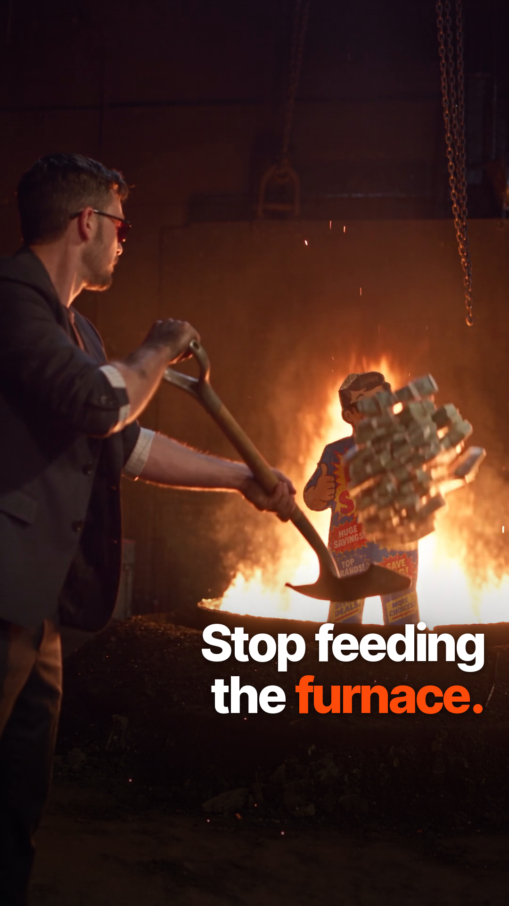
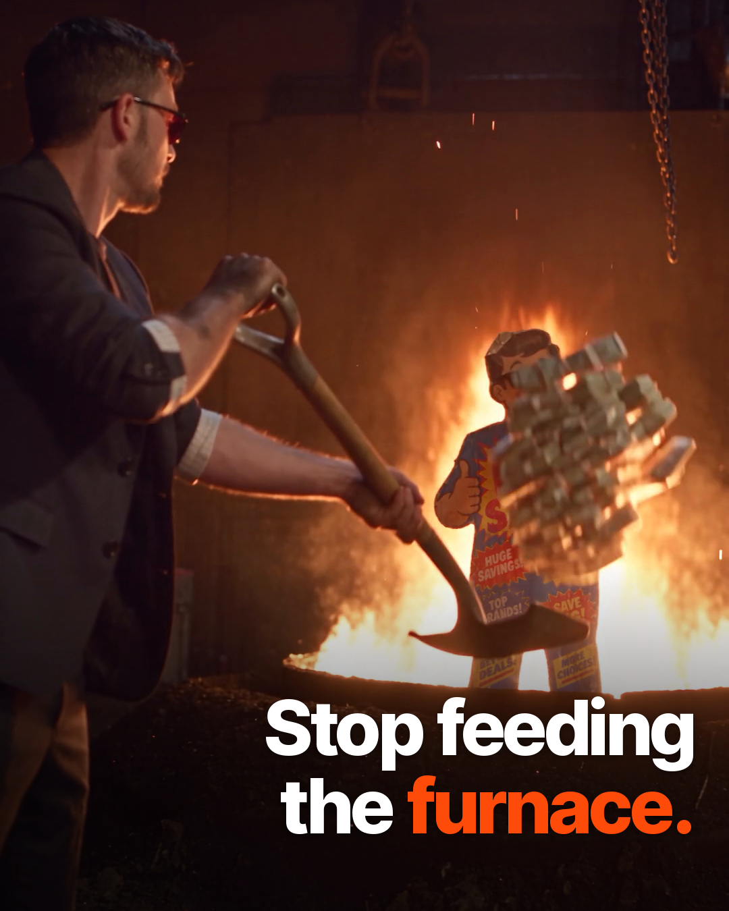
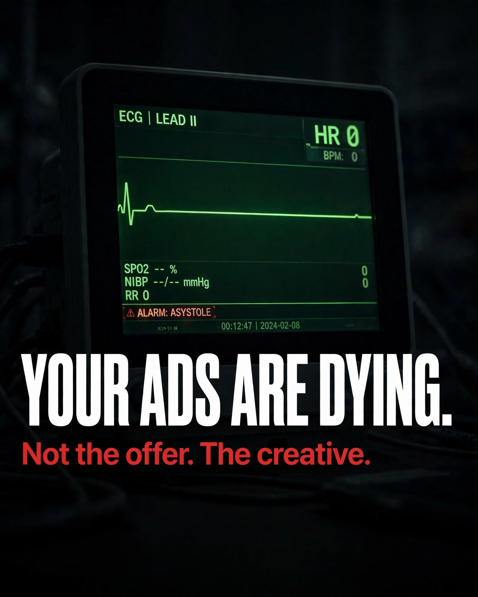
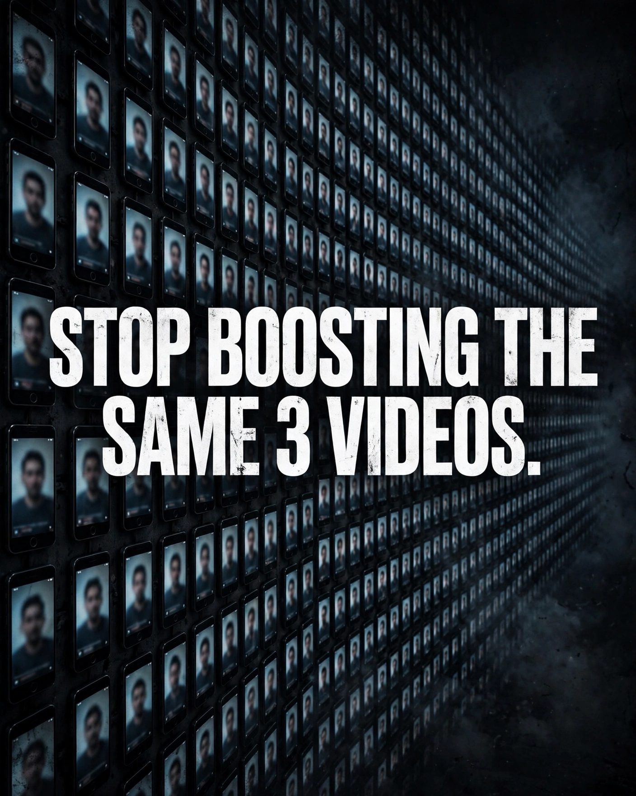

# FINALS: approved Revboo assets

> **Other AIs / editors: only use files listed under APPROVED below.** Everything else in the library is unreviewed (or rejected). Ask Chase before using it.
> Shared catalog: these videos are concept **RB-005** in `catalog/registry.json` (see [AGENTS.md](AGENTS.md)). Registry status is **Review** with `approved_asset_id` null until Chase confirms the patched last word by ear; then record his approval there (by/at/sha256).
> Generated by `make_finals.py` from `manifest.json` + `covers.json`. Machine-readable copy: [`finals.json`](finals.json). Library page: https://cryptouprise.github.io/revboo-library/

## APPROVED videos

### Revboo Video Ad 1 (Furnace): "Furnace – Captioned Paid Ad"

**Correct final VO (word for word):** "Before you throw more money at your ads, look at what you're feeding. Don't fire your media buyer. Give them better ads. Revboo, the revenue boost your **ads** can't afford to miss."

> If a Furnace file ends with "your **abs**" or "your **apps** can't afford to miss", it is the BAD version. Do not use it.

| Role | File | Size | Length | Full-quality master | Web copy (≤6 MB) |
|---|---|---|---|---|---|
| MAIN cut: Reels/TikTok/Shorts/Stories | `furnace-captioned-9x16-v1` | 1080x1920 (9:16) | 17.5 s | [download](https://github.com/Cryptouprise/revboo-library/releases/download/media-v1/furnace-captioned-9x16-v1-MASTER.mp4) | [download](https://github.com/Cryptouprise/revboo-library/releases/download/media-v1/furnace-captioned-9x16-v1.mp4) |
| Feed cut (FB/IG feed) | `furnace-captioned-4x5-v1` | 1080x1350 (4:5) | 17.5 s | [download](https://github.com/Cryptouprise/revboo-library/releases/download/media-v1/furnace-captioned-4x5-v1-MASTER.mp4) | [download](https://github.com/Cryptouprise/revboo-library/releases/download/media-v1/furnace-captioned-4x5-v1.mp4) |
| TEST variant: A/B against the main cut | `furnace-captioned-9x16-hookcover-v1` | 1080x1920 (9:16) | 18.8 s | [download](https://github.com/Cryptouprise/revboo-library/releases/download/media-v1/furnace-captioned-9x16-hookcover-v1-MASTER.mp4) | [download](https://github.com/Cryptouprise/revboo-library/releases/download/media-v1/furnace-captioned-9x16-hookcover-v1.mp4) |

- `furnace-captioned-9x16-v1`: Style C captions (Inter Tight ExtraBold, white + one orange #FF4B0A word), placed off his face/torso. +2.5 s end-card hold with sound-off line "Get more out of your ad budget." -14 LUFS.
- `furnace-captioned-4x5-v1`: Per-shot reframe of the main cut; captions re-placed for 4:5.
- `furnace-captioned-9x16-hookcover-v1`: 1.25 s opening cover "Your ads are dying. Not the offer. The creative." (Muse thumbnail 01 line), then the main cut. Not a replacement.

**Notes:** Correct final ends with "...your ads can't afford to miss." The original Seedance VO said "abs"; the last word was audio-patched to "ads" (same voice, taken from 0:02). Whisper large-v3/medium.en/small.en now hear "your ads can't afford to miss" (p 0.995/0.977/0.984). Chase should confirm by ear.  
Date: Oct 4, 2026. Box masters: `/workspace/revboo/edits/fire-money-captioned/Revboo-Furnace-Captioned-*.mp4`.

## APPROVED cover / thumbnail assets

| Preview | File | For | Aspect | Line | Made by | Notes |
|---|---|---|---|---|---|---|
|  | [`covers/furnace-cover-9x16.png`](covers/furnace-cover-9x16.png) | Furnace – Captioned Paid Ad | 9:16 (1080x1920) | Stop feeding the furnace. | Grok Bot (from ad frame 0:05.6) | Cover for the 9:16 Furnace cut. Frame: Chase shoveling cash toward the furnace. |
|  | [`covers/furnace-cover-4x5.png`](covers/furnace-cover-4x5.png) | Furnace – Captioned Paid Ad | 4:5 (1080x1350) | Stop feeding the furnace. | Grok Bot (from ad frame 0:05.6) | Cover for the 4:5 Furnace cut. |
|  | [`covers/muse-01_ads-are-dying.webp`](covers/muse-01_ads-are-dying.webp) | Revboo (general) | 4:5 (1408x1760) | YOUR ADS ARE DYING. / Not the offer. The creative. | Muse | Flatline ECG monitor. Its line is used as the hook in the Furnace hook-cover test variant. |
|  | [`covers/muse-02_secret-weapon.webp`](covers/muse-02_secret-weapon.webp) | Revboo (general) | 4:5 (1408x1760) | THE SECRET WEAPON. your media buyer has been waiting for | Muse | Desk with a glowing case. |
|  | [`covers/muse-03_2000-20-fresh.webp`](covers/muse-03_2000-20-fresh.webp) | Revboo (general) | 4:5 (1408x1760) | $2,000 / MONTH, 20 FRESH VIDEO ADS, EVERY. SINGLE. MONTH. | Muse | ⚠ **Yellow poster. PRICING NOT CONFIRMED: Chase has not confirmed the $2,000/month or 20-ads figures. Check with Chase before running it.** |
|  | [`covers/muse-04_stop-boosting.webp`](covers/muse-04_stop-boosting.webp) | Revboo (general) | 4:5 (1408x1760) | STOP BOOSTING THE SAME 3 VIDEOS. | Muse | Wall of phones. |

> ⚠ **Muse #03 ($2,000 / month, 20 fresh video ads): Chase has NOT confirmed this pricing.** Don't publish it until he does.

## REJECTED: do not use

| File | Why |
|---|---|
| `blast-furnace-take2` (Blast Furnace / Change the Creative, take 2 (furB fixed)) | REJECTED, do not use: same "your ABS can't afford to miss" voice-over as take 1 (the audio track is bit-identical; Whisper small.en/medium.en/large-v3 all hear "abs"). Only the end-card text was fixed. Kept for the archive. Use the captioned Furnace ad listed in FINALS.md. Original note: Shovels cash toward the furnace where the BIG SALE mascot burns, pulls the lever; end card 'Done-for-you video ads. Delivered weekly.' |
| `promo-v1` (The Revenue Engine, v1 (stills)) | Rejected: stills slideshow. Kept for the archive. |
| `blast-furnace-take1` (Blast Furnace / Change the Creative, take 1 · Seedance) | REJECTED, do not use: the last line says "your ABS can't afford to miss" instead of "ads" (Whisper small.en, medium.en and large-v3 all hear "abs", p 0.92-1.00, even when prompted toward "ads"). End card also misspelled "Donefor-your". Kept for the archive. Use the captioned Furnace ad listed in FINALS.md. Made about 10:30 PM MT on Sep 27. |
| `(unfiled) hf_20260928_043047_01aeba6a` (box: /workspace/revboo/inbox/higgsfield/_scan/vid/hf_20260928_043047_01aeba6a-4ac6-49d8-8537-322592a7d7c0.mp4) | Sibling Furnace generation. Also says "abs" (Whisper medium.en p0.82-0.94) and the end card is garbled ("Donefor-youf"). Not in the library; do not use. |

## Everything else

The other 63 finished ads and 90 clips in the library are **not reviewed**. They may be old drafts. Ask Chase before using any of them.

## Adding to this list
Only when Chase approves something: add it to `APPROVED` in `make_finals.py` (videos) or `covers.json` (images), run `python3 make_finals.py`, and commit.
